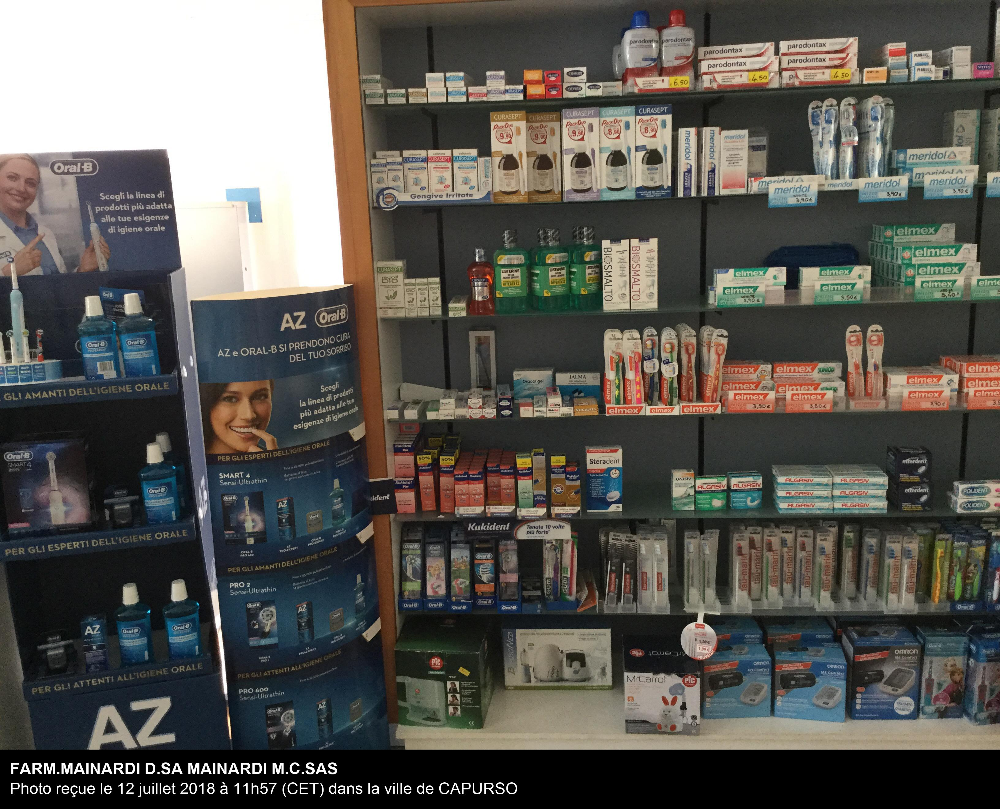
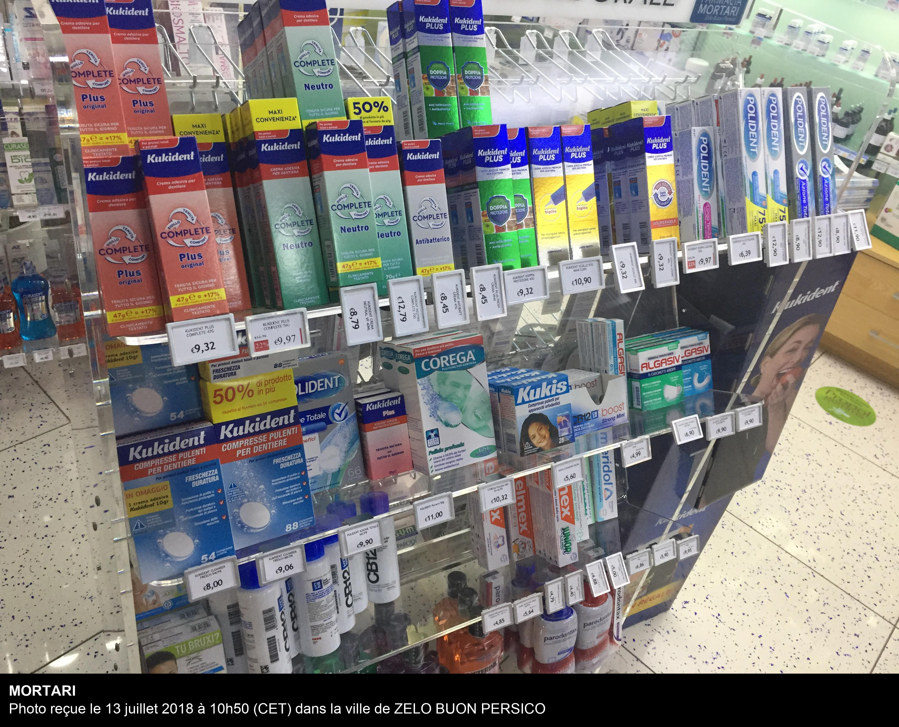
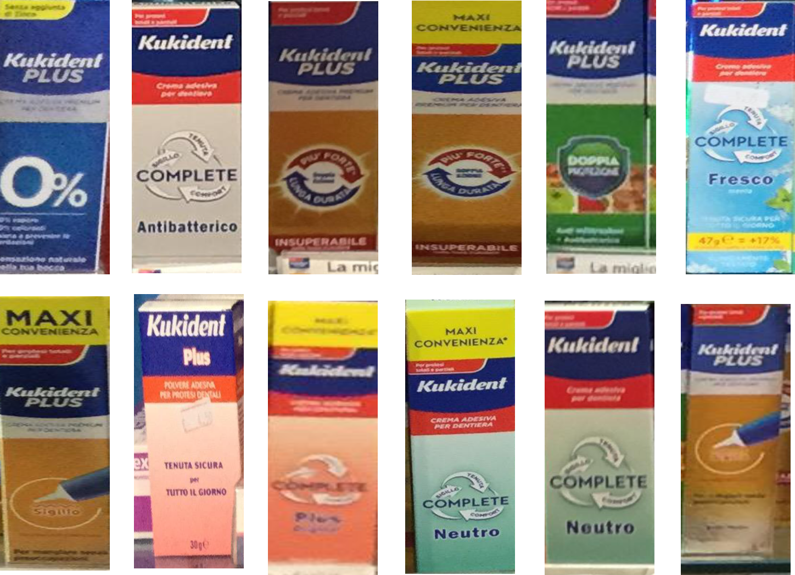

# Pharmacy-Medicines-detection-and-classification

## Part1 (Medicines Image classification):

### Data Gathering:

### Medicines different classes:

    'KUKIDENT 0% 40 GR': 0,
    'KUKIDENT ANTIBATTERICO 47 GR': 1,
    'KUKIDENT DOPPIA AZIONE 40 GR': 2,
    'KUKIDENT DOPPIA AZIONE 60 GR': 3,
    'KUKIDENT DOPPIA PROTEZIONE 40 GR': 4,
    'KUKIDENT FRESCO 47 GR': 5,
    'KUKIDENT NEUTRO 47 GR': 6,
    'KUKIDENT NEUTRO 70 GR': 7,
    'KUKIDENT PLUS 47 GR': 8,
    'KUKIDENT PLUS 70 GR': 9,
    'KUKIDENT POLVERE': 10,
    'KUKIDENT SIGILLO 40 GR': 11,
    'KUKIDENT SIGILLO 57 GR': 12,
    'POLIDENT AZ.TOTALE CREMA ADESIV 70G': 13,
    'POLIDENT FREE CR ADESIVA 70G': 14,
    'POLIDENT PROT.GENG CREMA ADES. 70G': 15
  

### Custom CNN model:

    _________________________________________________________________
    Layer (type)                 Output Shape              Param #   
    =================================================================
    conv2d_4 (Conv2D)            (None, 498, 198, 32)      896       
    _________________________________________________________________
    batch_normalization_5 (Batch (None, 498, 198, 32)      128       
    _________________________________________________________________
    activation_5 (Activation)    (None, 498, 198, 32)      0         
    _________________________________________________________________
    max_pooling2d_4 (MaxPooling2 (None, 249, 99, 32)       0         
    _________________________________________________________________
    conv2d_5 (Conv2D)            (None, 123, 48, 32)       25632     
    _________________________________________________________________
    batch_normalization_6 (Batch (None, 123, 48, 32)       128       
    _________________________________________________________________
    activation_6 (Activation)    (None, 123, 48, 32)       0         
    _________________________________________________________________
    max_pooling2d_5 (MaxPooling2 (None, 123, 24, 16)       0         
    _________________________________________________________________
    conv2d_6 (Conv2D)            (None, 113, 14, 32)       61984     
    _________________________________________________________________
    batch_normalization_7 (Batch (None, 113, 14, 32)       128       
    _________________________________________________________________
    activation_7 (Activation)    (None, 113, 14, 32)       0         
    _________________________________________________________________
    max_pooling2d_6 (MaxPooling2 (None, 113, 7, 16)        0         
    _________________________________________________________________
    flatten_2 (Flatten)          (None, 12656)             0         
    _________________________________________________________________
    dense_3 (Dense)              (None, 64)                810048    
    _________________________________________________________________
    batch_normalization_8 (Batch (None, 64)                256       
    _________________________________________________________________
    activation_8 (Activation)    (None, 64)                0         
    _________________________________________________________________
    dropout_2 (Dropout)          (None, 64)                0         
    _________________________________________________________________
    dense_4 (Dense)              (None, 16)                1040      
    =================================================================
    Total params: 900,240
    Trainable params: 899,920
    Non-trainable params: 320
    _________________________________________________________________
